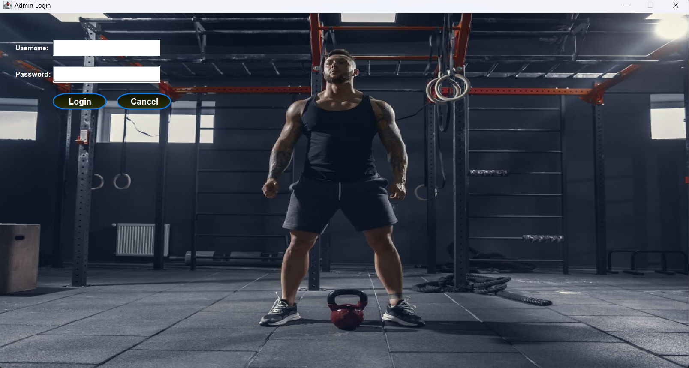
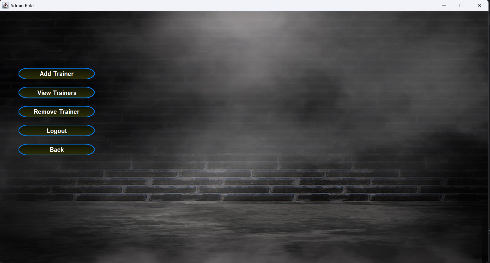
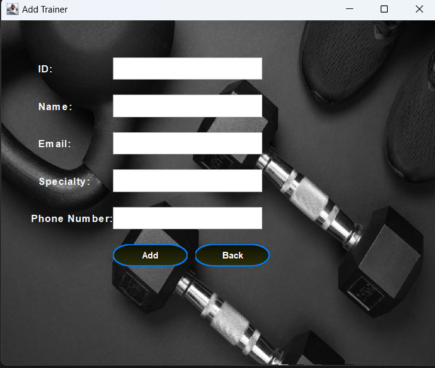
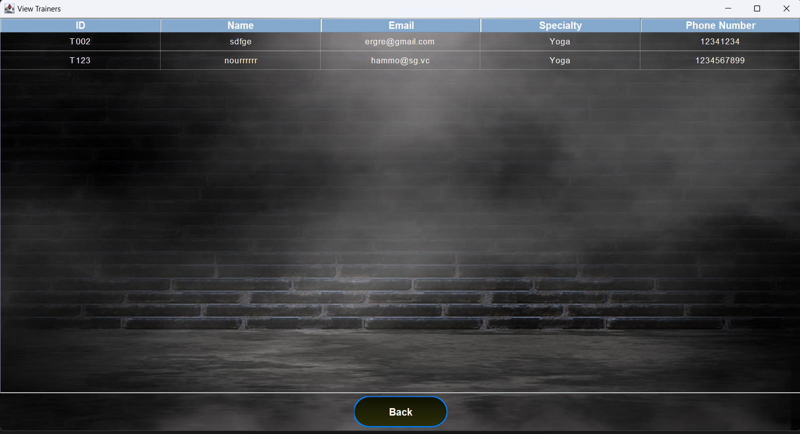
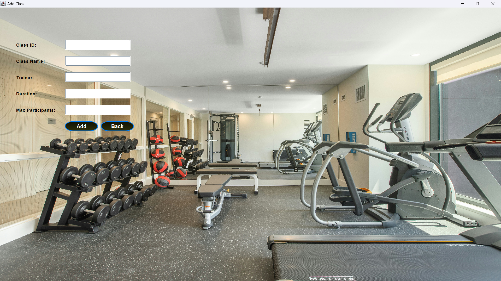

# Gym Management System

  

The Gym Management System is a desktop application developed as part of the CC272 Programming II course at Alexandria University. Built using Java and Swing, it provides an intuitive interface for gym administrators and trainers to manage gym operations efficiently. The system supports managing trainers, members, classes, and class registrations, with data persistence using text files. It incorporates input validations, a structured architecture, and a user-friendly GUI to ensure a seamless experience for users.

## Screenshots

### Gym Management System Welcome Screen
  
*The initial screen allowing users to choose between Admin and Trainer roles.*

### Admin Login Page
  
*The login page for administrators to access the system.*

### Trainer Login Page
  
*The login page for trainers to access their role-specific features.*

### Admin Role Menu
  
*The main menu for admins, providing options to add, view, remove trainers, and logout.*

### Add Trainer Page
  
*The page for admins to add a new trainer with details like ID, name, email, specialty, and phone number.*

### View Trainers Page
  
*The page displaying a list of all trainers in the system.*

### Trainer Role Menu
  
*The main menu for trainers, offering options to manage members, classes, and registrations.*

### Add Class Page
  
*The page for trainers to add a new class with details like ID, name, trainer, duration, and max participants.*

## Table of Contents

- [Features](#features)
- [Technologies Used](#technologies-used)
- [Architecture and Design](#architecture-and-design)
- [Algorithms and Techniques](#algorithms-and-techniques)
- [Project Structure](#project-structure)
- [Prerequisites](#prerequisites)
- [Installation](#installation)
- [Running the Application](#running-the-application)
- [Contributing](#contributing)
- [License](#license)
- [Acknowledgments](#acknowledgments)

## Features

### Admin Role
- **Add Trainer**: Admins can add new trainers with details such as ID, name, email, specialty (e.g., Yoga, Strength Training), and phone number. The system prevents duplicate trainer IDs.
- **View Trainers**: Displays a list of all trainers in the system, showing their ID, name, email, specialty, and phone number.
- **Remove Trainer**: Admins can remove trainers by their ID, ensuring the trainer list is up to date.
- **Logout**: Saves all trainer data to `Trainers.txt` before logging out, ensuring data persistence.

### Trainer Role
- **Add Member**: Trainers can add new members with details like ID, name, membership type (e.g., Monthly, Yearly), email, phone number, and status (e.g., active, expired). Duplicate member IDs are prevented.
- **View Members**: Displays a list of all members in the system.
- **Add Class**: Trainers can create new classes by specifying class ID, name, trainer ID, duration, and maximum participants. Duplicate class IDs are not allowed.
- **View Classes**: Shows a list of all classes available in the system.
- **Register Member for Class**: Allows trainers to register members for classes, checking for available seats and updating the class's available seats upon successful registration.
- **Cancel Registration**: Trainers can cancel a member’s class registration, increasing available seats if the cancellation is within 3 days of registration.
- **View Registrations**: Displays all class registrations, including member ID, class ID, registration date, and status.
- **Logout**: Saves all member, class, and registration data to their respective files (`Members.txt`, `Class.txt`, `Registration.txt`) before logging out.

### General Features
- **Input Validation**: All user inputs are validated to ensure correctness (e.g., email format, phone number format, non-duplicate IDs).
- **Data Persistence**: Stores data in text files (`Trainers.txt`, `Members.txt`, `Class.txt`, `Registration.txt`) in a comma-separated format for easy access and modification.
- **User-Friendly Interface**: Built with Java Swing, providing an intuitive GUI with background images reflecting the gym theme.

## Technologies Used

- **Java**: Version 17
- **Swing**: For building the graphical user interface
- **Text Files**: For data storage (`Trainers.txt`, `Members.txt`, `Class.txt`, `Registration.txt`)
- **Git**: For version control

## Architecture and Design

- **Layered Architecture**:
  - **Model Layer**: Includes data classes like `Trainer`, `Member`, `Class`, and `MemberClassRegistration` to represent entities, and database classes like `TrainerDatabase`, `MemberDatabase`, `ClassDatabase`, and `MemberClassRegistrationDatabase` to handle file I/O and data manipulation.
  - **View Layer**: Swing-based GUI components for user interaction (e.g., login pages, role menus, forms for adding trainers/classes).
  - **Controller Layer**: Role classes (`AdminRole`, `TrainerRole`) manage business logic and coordinate between the model and view layers.
- **Object-Oriented Principles**:
  - **Encapsulation**: Classes like `Trainer` and `Member` have private fields with access controlled via methods (e.g., `lineRepresentation`, `getSearchKey`).
  - **Single Responsibility**: Each class has a specific role (e.g., `TrainerDatabase` handles trainer data, `AdminRole` manages admin operations).
- **Design Patterns**:
  - **Repository Pattern**: Database classes (`TrainerDatabase`, `MemberDatabase`, etc.) act as repositories for managing data access and persistence.
  - **Facade Pattern**: Role classes (`AdminRole`, `TrainerRole`) provide a simplified interface to interact with multiple database classes.

## Algorithms and Techniques

- **Search Functionality**:
  - **Algorithm**: Linear search is used in database classes (e.g., `contains`, `getRecord`) to find records by their search keys (e.g., trainer ID, member ID).
  - **Complexity**: O(n) time complexity, where n is the number of records in the list.
- **Input Validation**:
  - **Technique**: Rule-based validation using regular expressions and custom checks.
  - **Examples**:
    - Email validation ensures the format matches a pattern (e.g., `user@domain.com`).
    - Phone numbers are checked for numeric format and length.
    - Duplicate IDs are prevented by checking against existing records.
- **File I/O**:
  - **Technique**: Reading and writing to text files in a comma-separated format.
  - **Process**:
    - `readFromFile`: Reads each line, parses it into an object, and stores it in an ArrayList.
    - `saveToFile`: Writes all records back to the file, overwriting the previous content.
  - **Complexity**: O(n) for both reading and writing, where n is the number of records.
- **Class Registration Management**:
  - **Technique**: Seat availability is checked before registration, and seats are updated upon registration or cancellation.
  - **Cancellation Policy**: Uses date comparison to check if cancellation is within 3 days of registration, leveraging `LocalDate` for date arithmetic.

## Project Structure

```
Gym-Management-System/
├── src/
│   ├── main/
│   │   ├── java/
│   │   │   ├── com/
│   │   │   │   ├── gymmanagementsystem/
│   │   │   │   │   ├── model/
│   │   │   │   │   │   ├── Trainer.java
│   │   │   │   │   │   ├── Member.java
│   │   │   │   │   │   ├── Class.java
│   │   │   │   │   │   ├── MemberClassRegistration.java
│   │   │   │   │   ├── database/
│   │   │   │   │   │   ├── TrainerDatabase.java
│   │   │   │   │   │   ├── MemberDatabase.java
│   │   │   │   │   │   ├── ClassDatabase.java
│   │   │   │   │   │   ├── MemberClassRegistrationDatabase.java
│   │   │   │   │   ├── role/
│   │   │   │   │   │   ├── AdminRole.java
│   │   │   │   │   │   ├── TrainerRole.java
│   │   │   │   │   ├── view/
│   │   │   │   │   │   ├── WelcomeView.java
│   │   │   │   │   │   ├── AdminLoginView.java
│   │   │   │   │   │   ├── TrainerLoginView.java
│   │   │   │   │   │   ├── AdminRoleView.java
│   │   │   │   │   │   ├── AddTrainerView.java
│   │   │   │   │   │   ├── ViewTrainersView.java
│   │   │   │   │   │   ├── TrainerRoleView.java
│   │   │   │   │   │   ├── AddClassView.java
│   │   │   │   │   ├── Main.java
│   │   ├── resources/
│   │   │   ├── images/
│   │   │   │   ├── welcome_screen.png
│   │   │   │   ├── admin_login_page.png
│   │   │   │   ├── trainer_login_page.png
│   │   │   │   ├── admin_role_menu.png
│   │   │   │   ├── add_trainer_page.png
│   │   │   │   ├── view_trainers_page.png
│   │   │   │   ├── trainer_role_menu.png
│   │   │   │   ├── add_class_page.png
│   │   │   ├── data/
│   │   │   │   ├── Trainers.txt
│   │   │   │   ├── Members.txt
│   │   │   │   ├── Class.txt
│   │   │   │   ├── Registration.txt
├── README.md
├── LICENSE
├── .gitignore
```

- `model/`: Defines data entities like `Trainer`, `Member`, `Class`, and `MemberClassRegistration`.
- `database/`: Manages file I/O and data operations for each entity.
- `role/`: Implements business logic for Admin and Trainer roles.
- `view/`: Swing-based GUI components for the frontend.
- `resources/data/`: Stores text files for data persistence.
- `resources/images/`: Contains screenshots for the `README.md`.

## Prerequisites

- **Java Development Kit (JDK)**: Version 17 or higher
- **IDE**: IntelliJ IDEA, Eclipse, or VS Code with Java extensions (optional but recommended)
- **Git**: To clone the repository

## Installation

1. **Clone the Repository**:
   ```bash
   git clone https://github.com/MostafaAbdulazziz/Gym-Management-System.git
   cd Gym-Management-System
   ```

2. **Verify Java Version**:
   ```bash
   java -version
   ```
   Ensure the output shows Java 17 or higher.

3. **Set Up the Data Files**:
   - Ensure the `resources/data/` directory contains the following text files: `Trainers.txt`, `Members.txt`, `Class.txt`, and `Registration.txt`.
   - If not present, create empty files with the following initial content:
     ```
     // Trainers.txt (empty example)
     T002,sdfe,ergre@gmail.com,Yoga,12341234
     T123,nourrrr,hammo@sg.vc,Yoga,1234567899

     // Members.txt
     (empty)

     // Class.txt
     (empty)

     // Registration.txt
     (empty)
     ```


## Running the Application

1. **Compile and Run**:
   - If using an IDE, open the project and run `Main.java`.
   - Alternatively, compile and run from the terminal:
     ```bash
     javac -d . src/main/java/com/gymmanagementsystem/*.java src/main/java/com/gymmanagementsystem/**/*.java
     java com.gymmanagementsystem.Main
     ```

2. **Access the Application**:
   - The application launches with a welcome screen where you can choose between Admin and Trainer roles.
   - For **Admin Login**, use default credentials (e.g., username: `admin`, password: `admin123`) or set up your own in the code.
   - For **Trainer Login**, use default credentials (e.g., username: `trainer`, password: `trainer123`) or set up your own.
   - Navigate through the role-specific menus to manage trainers, members, classes, and registrations.

## Contributing

We welcome contributions to enhance the Gym Management System! To contribute:

1. Fork the repository.
2. Create a new branch (`git checkout -b feature/your-feature`).
3. Make your changes and commit (`git commit -m "Add your feature"`).
4. Push to your branch (`git push origin feature/your-feature`).
5. Open a pull request with a clear description of your changes.

Please follow the [Code of Conduct](CODE_OF_CONDUCT.md) and ensure tests (if any) pass.

## License

This project is licensed under the [MIT License](LICENSE). See the [LICENSE](LICENSE) file for details.

## Acknowledgments

- Developed by Mostafa Abdul Aziz as part of the CC272 Programming II course at Alexandria University.
- Supervised by Dr. Layla Abou-Hadeed and teaching assistants.

